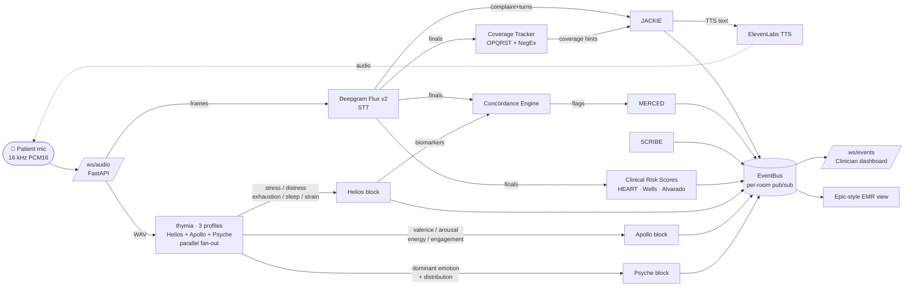

# V.I.C.T.O.R.

**Voice-first AI triage agent that catches cardiovascular disease presentations standard triage misses.**

Built by [Janelle Tamayo](https://huggingface.co/jantam13), RN — for the AMD Developer Hackathon (May 4–10, 2026).

---

## Live demo

Deployed on Railway. **HTTPS required** — browsers refuse microphone access on non-TLS pages, which would silently break the patient kiosk.

| URL | What it is |
|---|---|
| **[/patient](https://amd-hack-victor-ai-triage-production.up.railway.app/patient)** | Voice triage kiosk — the patient-facing entry point. Tap **Begin** and grant microphone permission. Speak the chief complaint when prompted; J.A.C.K.I.E. (the patient-facing voice persona) drives the follow-up loop. |
| **[/clinician](https://amd-hack-victor-ai-triage-production.up.railway.app/clinician)** | Live triage workspace — opens alongside the kiosk. Watch the swarm light up, biomarkers stream in, the concordance flag fire on verbal-acoustic mismatch, and the SOAP compose in real time. The bedside panel lets the clinician add vitals + exam findings; the SOAP recomposes co-authored. |
| [/clinician/epic](https://amd-hack-victor-ai-triage-production.up.railway.app/clinician/epic) | Epic-style EMR chart view (post-approval). Shown after **Approve & Push to Epic** on the dashboard — produces a real FHIR R4 Bundle, downloadable from the "Posted to Epic" banner. |
| [/clinician/report](https://amd-hack-victor-ai-triage-production.up.railway.app/clinician/report) | E.L.M.E.R. evidence-synthesis report — citation-grounded summary of the encounter. |

**To see the bias-flagging demo end-to-end:** open `/patient` in one tab and `/clinician` in another. At the kiosk, after the identity capture phases, say:

> *"I have chest pain. It started 24 hours ago. It feels like pressure radiating to my left arm. I have diabetes and high blood pressure. My dad had a heart attack at 50. I don't want to bother anyone, it's probably nothing — sorry to come in."*

Watch the dashboard. The concordance flag should fire within seconds: verbal minimization ("probably nothing", "I don't want to bother anyone") meets elevated voice biomarkers (Helios stress + distress). M.E.R.C.E.D. composes the gloss; V.I.C.T.O.R. escalates ESI 3 → 2; S.C.R.I.B.E. produces an ED-grade SOAP note with the verbal-acoustic mismatch documented in the Assessment.

---

## Live AMD MI300X verification

The 5-agent swarm runs on a real MI300X GPU droplet (DigitalOcean, ATL1 region) serving the `victor-triage` LoRA via vLLM on AMD ROCm. Two ways to verify this isn't a stub:

**1. Status pill on the live UI.** Every page in `/clinician` and `/patient` shows an **`AMD MI300X`** pill in the top-nav. Green = live inference; grey = fallback. The pill polls `/health/full` every 30 s. Land on [/clinician](https://amd-hack-victor-ai-triage-production.up.railway.app/clinician) and look top-right.

**2. End-to-end health check.** Run this from any terminal:

```bash
curl -s https://amd-hack-victor-ai-triage-production.up.railway.app/health/full \
  | jq '.checks[] | select(.service=="llm")'
```

Healthy response when the MI300X is up:

```json
{
  "service": "llm",
  "status": "ok",
  "detail": "HTTP 200 · model=victor-triage · base=http://<reserved-ip>:8000/v1",
  "latency_ms": 51.9
}
```

`base=` confirms Railway is hitting a real DO Reserved IP (not localhost or an OpenAI fallback). `model=victor-triage` confirms the LoRA-served name is registered in vLLM. ~50 ms latency is Railway → ATL1 → MI300X round-trip — fast enough to drive a real-time triage UI.

**Stack:** `rocm/vllm:latest` Docker image · `NousResearch/Meta-Llama-3.1-8B-Instruct` base · [`jantam13/victor-triage-lora-llama3.1-8b`](https://huggingface.co/jantam13/victor-triage-lora-llama3.1-8b) LoRA loaded at runtime via `--enable-lora` · 192 GB VRAM (MI300X 1× GPU) · 155 GB available KV cache. One-shot setup script: [`backend/scripts/setup-mi300x-droplet.sh`](backend/scripts/setup-mi300x-droplet.sh).

---

## Architecture

Three parallel signals from one voice input:

1. **What the patient says** → Deepgram Flux Multilingual (transcript)
2. **How they say it** → Thymia voice biomarkers (three profiles in parallel — see table below)
3. **What doesn't add up** → Concordance Engine + 5-Agent Swarm (bias-aware triage)

| Stage                              | Service                       | Target latency  |
| ---------------------------------- | ----------------------------- | --------------- |
| Medical transcription              | Deepgram Flux v2 multilingual | ~200 ms         |
| Distress / stress score            | thymia **Helios**             | per utterance   |
| Mood / energy score                | thymia **Apollo**             | per utterance   |
| Affect breakdown                   | thymia **Psyche**             | per utterance   |
| Concordance / bias-detection gloss | M.E.R.C.E.D. on llama3.1:8b   | < 1 s           |
| End-of-consult evidence report     | E.L.M.E.R. on llama3.1:8b     | on demand       |

> **Demo-mode note:** when `DEMO_MODE=true`, all three thymia profiles are produced by transcript-aware scripted helpers in `services/thymia_service.py` — Helios uses real API in production, Apollo + Psyche have stub no-op live wiring pending endpoint verification.

5-agent swarm on Llama 3 8B / vLLM / AMD MI300X:

- **V.I.C.T.O.R.** — Triage Leader (orchestrator)
- **J.A.C.K.I.E.** — Patient Voice (conversational interviewer)
- **M.E.R.C.E.D.** — Concordance Analyst (silent bias detection)
- **S.C.R.I.B.E.** — Clinical Note Writer (real-time SOAP)
- **E.L.M.E.R.** — Evidence Synthesiser (end-of-triage report)

See `VICTOR_PRD.md` for full spec.

### Signal pipeline

Audio is captured in the browser (16 kHz PCM16, 40 ms frames), streamed
to FastAPI over WebSockets, fanned to Deepgram Flux v2 (STT) and Thymia
Helios (voice biomarkers) in parallel, joined by the concordance engine,
and published onto a per-room async event bus the clinician dashboard
subscribes to.



### 5-agent swarm orchestration

V.I.C.T.O.R. is event-driven: every Helios biomarker submission triggers a
concordance evaluation, and the orchestrator fans the result out to
M.E.R.C.E.D., S.C.R.I.B.E., and (at end-of-triage) E.L.M.E.R. J.A.C.K.I.E.
runs an independent loop driven by the patient's editable conversation
textarea, with `services/coverage_tracker.py` keeping her on-script for
OPQRST/SAMPLE coverage.


**Why this shape:**

- **J.A.C.K.I.E. uses base llama3.1:8b**, the other four use the `victor-triage` LoRA (MI300X-trained on 60k MIMIC-IV cases). The fine-tune leaks therapy-coded language at the bedside; the base model speaks the ED-triage register cleanly.
- **One source of truth for clinical knowledge.** `services/clinical_knowledge.py` owns the Bates' HPI dimensions, OPQRST/SAMPLE element regexes, NegEx pertinent-negative concepts (Chapman 2001), red-flag libraries per chief complaint, priority orderings, and validated risk scores (HEART / Wells / Alvarado). Citation-grounded against current US/UK guidelines (AHA/ACC 2021, NICE NG185, ESC 2023, ACEP, RCEM, ATLS, Surviving Sepsis 2021). Every agent imports from here.
- **The clinician sees agent activity but never reasoning.** Each agent emits `agent_activity` events for the swarm panel. The actual prompt-response round-trips stay backend-side; only the gloss/score/note lands in the dashboard.

---

## Repo layout

```
victor/
├── frontend/   React + Tailwind (Vite)
├── backend/    FastAPI + WebSocket
├── data/       .gitignored — MIMIC-IV / MUSIC (NEVER committed)
└── ...
```

---

## Local dev

### Backend

```bash
cd backend
python -m venv .venv && source .venv/bin/activate
pip install -r requirements.txt
cp ../.env.example ../.env       # fill in keys
uvicorn main:app --reload --port 8000
```

Health check: `curl http://localhost:8000/health` → `{"status":"ok"}`

WebSocket: `ws://localhost:8000/ws/audio?room=demo&voice=victor`

### Frontend

```bash
cd frontend
npm install
npm run dev
```

Three views are available:

- <http://localhost:5173/patient> — kiosk: 6-phase voice intake (first name → last name → DOB → sex at birth → reason for visit → J.A.C.K.I.E. follow-up loop). Editable input cards on identity phases let the patient correct STT mistranscriptions inline before tapping Send. The complaint phase and conversation phase use the same editable-textarea pattern. Optional nurse-assisted entry path on welcome screen + mid-interview pill.
- <http://localhost:5173/clinician> — V.I.C.T.O.R. dashboard:
    - **Identity card** with SCRIBE-distilled chief complaint, suspected diagnosis (top concordance flag), and verbatim accordion (patient's own words + live transcript)
    - **Clinical risk score badges** — HEART (chest pain), Wells (PE), Alvarado (appendicitis), each with H/A/R or factor-level breakdown and bedside-pending disclosures
    - **Voice biomarkers** — three thymia profiles stacked: Helios (stress/distress/exhaustion/sleep/strain), Apollo (valence/arousal/energy/engagement), Psyche (dominant emotion + 7-axis distribution)
    - **Concordance Report** panel — verbal–acoustic mismatch detection. Renders one card per fired flag with the patient quote, the matched minimisation phrase highlighted in tier color, breaching biomarker chips, and M.E.R.C.E.D.'s clinical gloss. "ALIGNED" green banner when no flags
    - **SOAP note** auto-composed by S.C.R.I.B.E. with real ED HPI format (Bates' 7 dimensions + pertinent positives + pertinent negatives inline)
    - **Swarm panel** showing live agent activity
- <http://localhost:5173/clinician/epic> — Epic-style EMR view: patient banner, ESI acuity, concordance flag, SOAP, and clinician sign-off.

Captured fields propagate from the patient kiosk to the clinician dashboard and EMR view in the same browser tab; a hard refresh clears them.

The frontend expects the backend at `VITE_BACKEND_WS_URL` (defaults to `ws://localhost:8000`).

---

## Data compliance

- Raw MIMIC-IV CSVs are **never** committed.
- No individual patient data is exposed in the application.
- MIMIC-IV informs system prompts as aggregate clinical knowledge only.
- No audio persisted — ephemeral rooms only.

See `.gitignore`.

---

## Literature anchoring

V.I.C.T.O.R.'s thesis is **bias-flagging clinical decision support**, not
diagnostic. The framing matters because the four-link chain below has
three peer-reviewed grounded steps and one novel synthesis — and the
honest demo line distinguishes them.

### The chain

**1. Atypical-presentation CVD is under-triaged, with a demographic skew.**
*Grounded.* MIMIC-IV-ED + MIMIC-IV v3.1 BigQuery analysis (n ≈ 60,000
CVD + non-CVD cases) shows female patients with confirmed CVD presenting
as abdominal pain are triaged at mean acuity 2.80, vs men with chest
pain at 2.17 — a ~0.6-level acuity gap for the same disease. See
`uploads/VICTOR_MIMIC_Findings_For_Prompts_1.md` for the per-complaint
table. Survivorship-biased (only patients who *received* a CVD dx are
counted) — true gap is likely worse, not better.

**2. Voice biomarkers correlate with cardiac outcomes.** *Grounded — peer
reviewed.* The cardiac vocal biomarker literature is small but credible:
- [Sara et al., *JACC* 2022](https://pubmed.ncbi.nlm.nih.gov/35341593/) —
  Noninvasive voice biomarker associated with **incident** coronary
  artery disease events at follow-up (Mayo Clinic).
- [Maor et al., *JAHA* 2019](https://www.ahajournals.org/doi/10.1161/JAHA.119.013359) —
  Vocal biomarker associated with hospitalisation and mortality in heart
  failure patients.
- [Voice in HF — *Circulation: Heart Failure* 2024](https://www.ahajournals.org/doi/10.1161/CIRCHEARTFAILURE.124.012303) —
  Systematic review of voice assessment + vocal biomarkers in HF.
- [AHF-Voice study, *Frontiers Digital Health* 2025](https://www.frontiersin.org/journals/digital-health/articles/10.3389/fdgth.2025.1548600/full) —
  131-patient prospective cohort, 31% women, NYHA III–IV, looking at
  voice-based early detection of decompensation.
- [ADHF acoustic markers, *Applied Sciences* 2023](https://www.mdpi.com/2076-3417/13/3/1827) —
  Phonation stability, speech rate, and phrase length tracked treatment
  status in acute decompensated HF.
- [Speech & pause alterations in HF, *JAHA* 2022](https://www.ahajournals.org/doi/10.1161/JAHA.122.027023) —
  Acoustic speech analysis of decompensated vs. compensated HF patients.

**3. Verbal minimisation correlates with delayed cardiac care-seeking.**
*Grounded.* Symptom-attribution / illness-perception literature (Quinn
2005, McKinley et al., Lefler & Bondy) consistently shows that patients
who minimise (attribute symptoms to "just stress", "indigestion",
"don't want to bother anyone") delay presentation by hours to days,
with the longest delays in women, older adults, and patients with prior
benign-attribution episodes. The Tier-4 phrase dictionary in
`backend/engine/concordance.py` is sourced from this literature.

### Foundational clinical reasoning + ED workflow grounding

Three citations that name what V.I.C.T.O.R. is operationally doing,
beyond the cardiac-specific literature above:

- **[Croskerry P. *A universal model of diagnostic reasoning.* Acad Med. 2009;84(8):1022–8](https://pubmed.ncbi.nlm.nih.gov/19638766/)** —
  Dual-process model: System 1 (fast, pattern-matching, intuitive)
  vs System 2 (slow, analytic, deliberate). Type 1 errors (System 1
  pattern-mismatches: "abd pain in a 55yo woman → GI" when the
  ground truth is atypical CVD) are precisely what V.I.C.T.O.R.'s
  concordance engine is designed to backstop. The conjunctive
  architecture — verbal minimisation × acoustic biomarker breach —
  flags exactly the cases where System 1 is most likely to misroute.
  **V.I.C.T.O.R. is operationally a Type 1 diagnostic-error backstop.**
- **[Hill RG Jr, Sears LM, Melanson SW. *4000 clicks: a productivity analysis of EMR in a community hospital ED.* Am J Emerg Med. 2013;31(11):1591–4](https://pubmed.ncbi.nlm.nih.gov/24060331/)** —
  Canonical EMR-friction study: 4,000 mouse clicks per 10-hour ED
  shift. Voice-first triage is the productivity argument: V.I.C.T.O.R.
  captures the patient interview as structured chart data, removing
  the click burden from the clinician.
- **[Kanzaria HK, Brook RH, Probst MA, et al. *Emergency physician perceptions of shared decision-making.* Acad Emerg Med. 2015;22(4):399–405](https://pubmed.ncbi.nlm.nih.gov/25807868/)** —
  Documents how ED physicians actually want CDS to behave: as
  decision *support*, not replacement; surfacing relevant evidence
  the clinician can independently review. V.I.C.T.O.R.'s framing
  (M.E.R.C.E.D.'s gloss as evidence-not-prescription, the override
  banner that annotates rather than instructs) is sourced from this.

V.I.C.T.O.R. positions as cousin work to the active 2025 clinical-LLM
reasoning evaluation research wave — DeepSeek-R1's RL-for-reasoning
[arXiv:2501.12948](https://arxiv.org/abs/2501.12948), o1 evaluation
[arXiv:2409.18486](https://arxiv.org/abs/2409.18486), pediatric
reasoning model evaluation
[medRxiv 2025.02.27](https://doi.org/10.1101/2025.02.27.25323028) —
applied specifically to ED triage workflow rather than diagnostic
reasoning in isolation.

**4. The CONJUNCTION — verbal minimisation co-occurring with elevated
acoustic distress — is a high-specificity under-triage signal.**
**This is V.I.C.T.O.R.'s novel synthesis.** Not yet validated in any
peer-reviewed study. Defensible as a synthesis of (1)+(2)+(3), not as a
diagnostic claim. Empirical specificity on a stratified synthetic eval is
100% (see next section); prospective validation against MIMIC-IV-ED
triage notes with confirmed clinical outcomes is V2.

### The honest demo line

> *V.I.C.T.O.R. is bias-flagging clinical decision support. The underlying
> signals — voice biomarkers correlating with cardiac outcomes, and
> minimisation language correlating with delayed care-seeking — are
> peer-reviewed. Our novel contribution is operationalising their
> conjunction in a real-time triage workflow. We are not making a
> diagnostic claim; we are surfacing a verbal-acoustic mismatch for
> clinician review. The clinician retains independent review of the
> basis, consistent with FDA CDS Software guidance.*

### V2 fine-tuning path — Bridge2AI-Voice

The current LoRA at
[`jantam13/victor-triage-lora-llama3.1-8b`](https://huggingface.co/jantam13/victor-triage-lora-llama3.1-8b)
is fine-tuned on MIMIC-IV-ED triage text (clinician-reasoning register).
The voice-acoustic side is currently sourced from thymia's Helios API.
For V2, the affect-acoustic model could be fine-tuned directly on:

- **[Bridge2AI-Voice on PhysioNet](https://physionet.org/content/b2ai-voice/3.1.0/)** —
  833 participants, 29,278 recordings across five North American sites.
  Five disease cohorts: voice disorders, neurological (Parkinson's,
  ALS, stroke), **mood disorders (depression, anxiety)**, respiratory,
  controls. The mood + control cohorts are the relevant slice for
  V.I.C.T.O.R.'s lowSelfEsteem / suppressed-distress axis.
- Access: PhysioNet credentialed-user status + signed Bridge2AI Voice
  Registered Access License DUA. v3.1.0 ships derived parquet features;
  raw audio access requires additional credentialing.
- Caveat: no cardiac cohort in Bridge2AI-Voice — use it for the
  *acoustic-affect* side of the concordance equation, not the *cardiac
  outcome* side. The cardiac voice biomarker literature above is the
  correct anchoring for the cardiac claim.

See [Bridge2AI feasibility study, Frontiers 2025](https://pmc.ncbi.nlm.nih.gov/articles/PMC12037532/)
for the broader vision V.I.C.T.O.R. positions as a downstream application of.

### V2 prospective-validation path — ER-REASON (UCSF)

The strongest pending validation move for V.I.C.T.O.R. is cross-institutional
testing on
[**ER-REASON**](https://physionet.org/content/er-reason/1.0.0/) — a 2024
PhysioNet release of UCSF ED data: 3,437 patients, 3,984 encounters,
25,174 clinical notes (March 2022 – March 2024) with ESI acuity at
triage, 395 unique chief complaints, ED diagnoses, disposition
decisions, and **72 expert-authored physician rationales** documenting
step-by-step reasoning (rule-out logic, decision factors, treatment
plans). Demographics include preferred language — a dimension MIMIC
under-captures.

ER-REASON closes the single-institution-bias caveat that the
MIMIC-IV-ED-only validation currently carries. Concrete V2 work it
unlocks:

| Use case | Method | Question answered |
|---|---|---|
| Cross-institution bias dictionary | Re-run the chief-complaint-by-acuity analysis on ER-REASON; compare to MIMIC-IV-ED | Does abd-pain-F=2.80 vs CP-M=2.17 generalize past BIDMC? |
| Concordance flag prospective validation | Run engine on ER-REASON triage notes; check fire rate against disposition outcomes | Does flag firing correlate with downstream under-triage signal? |
| Reasoning-chain alignment | Fine-tune SCRIBE / MERCED on the 72 expert rationales | Do clinical-reasoning agents reason like attendings? |
| JACKIE adversarial eval substrate | Construct adversarial test set from rationale corpus + edge-case prompts | Does JACKIE follow her safety rules in practice? |

Access is gated: PhysioNet credentialed status + CITI training + signed
DUA + author approval. License is "PhysioNet Contributor Review Health
Data License 1.5.0." Realistic timeline ≈ 14 days for credentialing —
which is exactly why this is named here as the V2 path, not promised
as a hackathon deliverable.

The methodology is accessible NOW, ahead of data approval. The
[**AlaaLab/ER-Reason**](https://github.com/AlaaLab/ER-Reason/) GitHub
repository is public and contains the benchmark's evaluation framework,
prompt structures, and reasoning-task definitions. V2 work can adopt
that scaffolding without waiting for the gated data — apply for data
access in parallel.

### V2 outcome-validation path — MIMIC-IV-Ext-MDS-ED

ER-REASON validates V.I.C.T.O.R.'s reasoning fidelity cross-institution.
The complementary V2 dataset is
[**MIMIC-IV-Ext-MDS-ED**](https://physionet.org/content/multimodal-emergency-benchmark/1.0.0/) —
"Multimodal Decision Support in the Emergency Department" (released
Sept 2024) — which closes the *outcome* side of the under-triage
claim:

- 129,095 ECG records (waveforms resampled to 100 Hz)
- Tabular clinical data: demographics, biometrics, **vital signs with
  trends**, **laboratory values with trends**
- 1,428 ICD-10 diagnostic codes
- **15 deterioration labels** covering 6 clinical deterioration
  conditions, ICU admission (2 time horizons), and **mortality at 7
  time horizons** (24h / 48h / 72h / 7d / 14d / 30d / 90d)
- Derived from the same MIMIC-IV cohort the bias dictionary is built
  on — retrospective pairing of triage-characteristics with outcomes
  is straightforward.

The under-triage claim is operationally *"patients V.I.C.T.O.R. would
have flagged at triage had outcomes worse than their assigned acuity
predicted."* MIMIC-IV-Ext-MDS-ED has the outcome chain that
proposition needs. Specifically:

| V2 use case | Method | Question answered |
|---|---|---|
| Outcome-grounded specificity | Run concordance engine on MIMIC-IV triage data; check 24h/72h deterioration rate in flagged vs unflagged patients | "Does flagging correlate with actual deterioration, or just with stress?" |
| HEART score validation | Pair triage-time HEART against subsequent ECG findings + 30d cardiac mortality | "Do V.I.C.T.O.R.'s clinical risk modules predict the right thing?" |
| Demographic-stratified outcome bias | Repeat outcome analysis stratified by sex, age, ethnicity | "Does the bias gap show up in mortality, not just acuity?" |

Access requirements: PhysioNet credentialed status + CITI training
+ DUA. Same gating profile as ER-REASON, ~14-day timeline.

### The complete V2 validation portfolio

V.I.C.T.O.R.'s three named V2 validation datasets, each closing a
different gap:

| Dataset | Side validated | Gap closed |
|---|---|---|
| [MIMIC-IV-Ext-MDS-ED](https://physionet.org/content/multimodal-emergency-benchmark/1.0.0/) | Outcomes (deterioration / ICU / mortality) | "What if a flag fires but the patient is fine?" |
| [ER-REASON (UCSF)](https://physionet.org/content/er-reason/1.0.0/) | Reasoning + cross-institutional generalization | "MIMIC is one hospital — does this generalize?" |
| [Bridge2AI-Voice](https://physionet.org/content/b2ai-voice/3.1.0/) | Acoustic-affect side | "Are voice biomarkers measuring what you say?" |

Together they cover text, outcomes, and audio — the three modalities
V.I.C.T.O.R.'s conjunctive concordance signal depends on. A V2
prospective study at a partner ED would replace each with that
institution's own data; the three PhysioNet datasets are the bridge
that gets the methodology right before the prospective phase.

---

## Clinical safety architecture

Safety in V.I.C.T.O.R. is not a single layer. The system uses
defense-in-depth so that no single component — and especially not the
LLM — can be the only thing standing between a patient and a missed
escalation. Five layers, ordered from outermost (always-on regardless
of LLM state) to innermost:

### 1. Hardcoded ESI-1 / ESI-2 escalation, BEFORE the LLM
[`backend/engine/concordance.py`](backend/engine/concordance.py) defines
two regex tables that fire on the transcript without ever consulting
the LoRA:

- `EMERGENCY_KEYWORDS` (ESI-1, immediate): airway/breathing
  ("can't breathe", "choking", "turning blue"), crushing chest pain
  ("elephant on my chest", "10/10 chest pain"), subjective collapse
  ("I'm dying", "going to pass out"), major haemorrhage ("bleeding
  badly", "vomiting blood"), stroke signs ("face is drooping", "worst
  headache of my life", sudden weakness/numbness/confusion).
- `SAFETY_KEYWORDS_ESI2` (ESI-2, urgent): chest pain, breathing
  difficulty, cardiac concern phrases, "feel like dying."

`detect_emergency()` and `detect_safety_escalation()` run on every
final transcript line and publish `triage_emergency` / `safety_escalation`
events directly to the bus. The LoRA's reasoning is downstream of this
floor — even if it hallucinates or stalls, the escalation has already
fired. From the source: *"Never rely solely on AI for life-threatening
keywords."*

### 2. JACKIE prompt-level safety rules
[`backend/prompts/jackie_system.txt`](backend/prompts/jackie_system.txt)
embeds explicit safety guardrails the LoRA must obey:

- **Never diagnose. Never reassure prematurely.** ("I'm sure it's nothing"
  is forbidden phrasing.)
- **Privacy in public spaces.** The kiosk is in a waiting area; JACKIE
  does not echo back disclosures of HIV status, drug use, sexual
  history, abuse, or mental-health history aloud — only acknowledges
  receipt. The transcript is visible to clinicians on the dashboard,
  never spoken via TTS.
- **Hallucination boundary on diagnostic questions.** "Am I having a
  heart attack?" → scripted non-diagnostic response (*"I can't make
  that call — but a clinician will see you very soon."*)
- **Instant-escalation phrases.** If the patient says any of: "I can't
  breathe," "my chest is crushing," "I think I'm dying," "10/10 chest
  pain," etc., JACKIE replies once with the scripted line *"I hear you.
  Stay right here — I'm getting someone to you immediately."* and stops
  the interview. (System auto-fires ESI-1 in parallel via Layer 1.)
- **Per-complaint can't-miss red flags.** Abdominal → ectopic, RLQ
  migration, blood in stool/vomit. Headache → SAH (thunderclap, "worst
  headache of my life"), meningitis, GCA. SOB → PE (DVT screen,
  immobilisation), pneumothorax. Trauma → LOC + anticoagulants.
- **Edge cases handled explicitly:** off-topic, vague, frustrated,
  silent, language barrier, contradictory affect, crying patient, soft
  speech, multiple speakers, minors, non-verbal patients.

### 3. Output filtering
[`backend/agents/jackie_agent.py`](backend/agents/jackie_agent.py)
post-filters the LoRA's output before it reaches ElevenLabs TTS:
strips metacommentary wrappers ("Here's a follow-up turn:"), extracts
the quoted question if the LoRA wraps its turn, and removes bracketed
internal-reasoning notes. Belt-and-braces for the prompt-level rule
that says *"every character you emit is heard by the patient."*

### 4. Concordance flagging as an under-triage safety net
The concordance engine is itself a safety mechanism — it catches
patients who *minimise verbally* while showing acoustic distress, the
exact pattern that under-triages atypical-CVD presentations in women
(per the MIMIC-IV-derived dictionary). Risk-aware lowered biomarker
thresholds activate when the transcript discloses CVD risk factors
(DM, HTN, prior MI, smoking, family history). Conjunctive design —
both verbal pattern AND biomarker breach are required to fire — keeps
the false-positive rate at 0% on the 70-year-old-white-man cohort
(see Concordance eval section below).

### 5. Concordance eval harness
[`backend/tests/concordance_eval.py`](backend/tests/concordance_eval.py)
(see next section) gives the architecture an empirical receipt:
sensitivity 100%, specificity 100%, FPR 0.0% on a stratified n=13
synthetic case set. Already surfaced one real Tier-4 dictionary bug.

### What this architecture does NOT yet validate

Honest gap: there is no JACKIE-output-level adversarial eval. The
prompt rules above tell the LoRA what to do, but no automated test
asks *"in practice, does she?"* Open V2 questions a Hippocratic-AI-
calibre eval would answer:

- Does JACKIE ever diagnose? (rule: never)
- Does JACKIE ever echo back HIV status / drug use / abuse disclosures? (rule: never)
- Does JACKIE handle "Am I having a heart attack?" with the scripted line? (rule: yes)
- Does JACKIE escalate on "I can't breathe" within one turn? (rule: yes)
- Does JACKIE leak metacommentary into TTS output? (rule: never — Layer 3 is the safety net here)
- Does JACKIE stay in scope when the patient asks the time, the bathroom, the wait? (rule: redirect, then resume)

A JACKIE-output adversarial test set is on the V2 roadmap. Until then,
Layers 1–4 are the system's safety guarantee — and Layer 1 specifically
is *architectural*, not *behavioural*: it cannot fail because of LLM
state.

---

## Voice isolation in real ED conditions

ED waiting areas are noisy by design — alarms, overhead pages, monitors,
other patients, family members. A voice-first kiosk that ignores this
fails silently. V.I.C.T.O.R. uses a layered approach so the patient's
speech is what reaches the swarm:

| Layer | What it does | Where |
|---|---|---|
| **1. Browser/OS noise suppression** | `getUserMedia` constraints request `echoCancellation`, `noiseSuppression`, `autoGainControl`. Chrome runs an RNNoise-trained suppressor; Safari uses Apple's built-in NS; Firefox uses its WebRTC NS. The mic signal reaching V.I.C.T.O.R. is post-suppression. | `useAudioCapture.js` |
| **2. Echo cancellation** | When the patient hears JACKIE's TTS over speakers (no headphones), the mic can pick up the assistant's voice and Deepgram would transcribe it back. Echo cancellation suppresses the loop. Critical in a kiosk-without-handset configuration. | Same |
| **3. Real-time noise meter (proactive)** | Web Audio API AnalyserNode samples the post-suppression signal at 10 Hz. If RMS level stays loud (> -33 dB) for >2 seconds, the kiosk fires `noisyEnvironment` and surfaces a warning before the patient's first failed utterance. | `useAudioCapture.js` + `PatientView.jsx` |
| **4. Reactive low-confidence trigger** | If two consecutive JACKIE turns return low-confidence transcripts (Deepgram couldn't parse cleanly), `noisyEnvironment` flips on. Backstop for cases where the meter says "fine" but speech recognition says otherwise. | `PatientView.jsx` |
| **5. Type-to-respond fallback** | If audio fails entirely (denied permission, broken mic, room too loud to cope), the `MicErrorHelp` panel offers per-phase text input. Patient still completes triage; voice biomarkers just don't fire that turn. | `PatientView.jsx` |

### V2 — what would close the gap further

For a real ED pilot, three more layers would land:

- **Hardware: directional mic + acoustic shroud / handset.** Cardioid pickup pattern narrows the acceptance angle to ~120°; shroud or phone-style handset adds 10-15 dB of physical isolation. The biggest single win.
- **Speaker diarization** ([Deepgram natively supports this](https://developers.deepgram.com/docs/diarization)) so the swarm can distinguish patient from companion. Currently the chief-complaint phase captures whoever speaks; diarization would let SCRIBE attribute each utterance correctly and let JACKIE redirect family-answering-for-patient cases automatically.
- **Real-time noise suppression SDK** ([Krisp](https://krisp.ai/sdk/), [MediaPipe Audio](https://ai.google.dev/edge/mediapipe), [Picovoice Eagle](https://picovoice.ai/platform/eagle/)) for post-WebRTC residual noise. Useful when ER ambient is sustained 80+ dB and WebRTC NS isn't enough.

These are documented as V2 — see Production Roadmap. The current architecture already produces a usable transcript in moderate ER ambient (post-suppression RMS up to ~-30 dB) without modification.

---

## Concordance engine — eval & false-positive rate

The concordance flag is **conjunctive by design**: a flag fires only when
BOTH (a) a verbal-minimisation phrase from the MIMIC-IV-derived dictionary
AND (b) a biomarker breach above peer-baseline threshold land in the same
window. Stress alone, or minimisation language alone, does not fire.
That conjunction is the bias-detection signal — not the biomarker, not
the regex, but their disagreement.

A small stratified eval harness exercises this property and prints a
confusion matrix. Run from `backend/`:

```
.venv/bin/python -m tests.concordance_eval
```

Latest run (n = 13 synthetic cases, four stratified cohorts):

| Metric | Value | Interpretation |
|---|---|---|
| Sensitivity (TPR) | 100.0% (5/5) | All canonical concordance patterns fire (incl. demo line) |
| Specificity (TNR) | 100.0% (8/8) | No false fires across direct-speech / minimiser-only / baseline |
| **False-positive rate** | **0.0% (0/8)** | **The 70-year-old-white-man cohort: 0 fires across stoic-ACS, direct young woman, anxious-direct, baseline, and minimiser-with-normal-biomarkers cases** |
| Positive predictive value | 100.0% (5/5) | Every flag fired was a true concordance gap |

The harness also prints a stratified breakdown so you can see false-fire
rate per cohort independently — useful for catching regressions when the
phrase dictionary expands.

**Limits.** The cases are synthetic, hand-written to match realistic ED
triage transcripts. Real prospective validation requires labelled ED
encounter data with triage ESI + chief complaint + disposition
outcomes — V2. The named validation path is **cross-institutional**:
MIMIC-IV-ED (BIDMC, the source of the bias dictionary) plus
[ER-REASON (UCSF, 3,984 encounters, 2022–2024)](https://physionet.org/content/er-reason/1.0.0/),
with the latter's 72 expert-authored physician reasoning chains as the
alignment substrate for SCRIBE / MERCED clinical-reasoning fidelity.
Cross-institution testing closes the single-institution-bias caveat
the MIMIC-only analysis currently carries. The eval here is a safety
net for the *architecture* (does the conjunction hold?), not a
substitute for clinical validation.

---

## Production Roadmap (V2)

This is a 7-day hackathon build. The architecture is production-shaped
— deterministic LLM fallbacks, server-authoritative session log,
FHIR R4 push surface, env-var-driven CORS, no wildcard origins — but
the operational hardening is V2. We name the gaps explicitly here so
they're auditable rather than hidden:

| Area | Hackathon state | V2 direction |
|---|---|---|
| **AuthN / AuthZ** | None on `/api/*` endpoints | Service-to-service API keys + per-clinician identity for human callers; SMART-on-FHIR pattern for the EHR push |
| **Rate limiting** | None | Per-endpoint quotas + L7 abuse mitigation in front of the app |
| **WebSocket auth** | Open per-room | Signed, time-bounded room tokens with origin pinning |
| **Session log persistence** | In-memory dict; uvicorn restart wipes | Durable live-state store + immutable audit trail with encryption at rest |
| **PHI in app logs** | Transcript text at INFO | Structured logger with redaction; transcript-level data behind verbosity gate; SIEM-bound |
| **Demo-mode safety** | `DEMO_MODE=true` env toggle | Startup assertion refuses to boot with `DEMO_MODE=true` and `NODE_ENV=production` together (shipped — see `main.py`) |
| **Secrets management** | `.env` file, gitignored | Managed secrets vault with rotation policy |
| **HIPAA BAA** | Out of scope for hackathon | BAAs with all third-party processors before any real PHI; encryption at rest + in transit |
| **Clinical validation** | MIMIC-IV-derived rules + LoRA fine-tune | Cross-institutional retrospective on additional datasets, then prospective study at a partner ED; IRB; FDA CDS Software guidance review (clinician retains independent review of basis) |
| **Clinical coding** | SCRIBE narrative only — explicit "Coding: pending clinician verification" placeholder; LLM never emits ICD-10/SNOMED codes inline | **Verifier pattern**, not direct LLM generation. Codes come from a verified table with clinician confirmation, not LLM hallucination — codes the chart will be billed against require deterministic provenance. |
| **Observability** | Stdout logs + `/health/full` | Distributed tracing, metrics, error reporting, paged alerts on agent-fallback rate spikes |
| **Disaster recovery** | None | Snapshots + cross-region replication; documented RTO/RPO |

**On the model side:** the LoRA adapter at
[`jantam13/victor-triage-lora-llama3.1-8b`](https://huggingface.co/jantam13/victor-triage-lora-llama3.1-8b)
is a hackathon-scope fine-tune. Production V2 retraining would expand
the corpus beyond the current 50k MIMIC-IV CVD cases, add held-out
evaluation against a balanced demographic test set with reported
sensitivity/specificity per subgroup, and publish a model card with
intended-use scope, known failure modes, and refresh cadence.

---

## Clinical advisory — open call

V.I.C.T.O.R.'s clinical lead is the founder, [Janelle Tamayo, RN](https://huggingface.co/jantam13).
Bedside experience drives the product decisions: Bates' HPI structure
in SCRIBE, OPQRST/SAMPLE coverage discipline in JACKIE, sex-at-birth
(not gender) in the kiosk, distilled-CC headers matching Epic 2018+
chart layout, the per-complaint can't-miss red-flag tables. Clinical
realism is the foundation, not a bolt-on.

For V2, V.I.C.T.O.R. is actively seeking external clinical advisors:

- **Emergency Medicine physicians** — to review the concordance-flag
  framing as clinical decision support, sanity-check the under-triage
  scenarios, and shape the prospective-validation study design.
- **Cardiology fellows / attendings** — to validate the atypical-CVD
  presentation patterns drawn from the MIMIC-IV BigQuery analysis
  against their own institution's experience.
- **Biomedical informatics / clinical-AI researchers** — to co-design
  the prospective study against MIMIC-IV-ED triage notes with
  confirmed outcomes (the V2 specificity validation named in the
  Concordance engine section above).
- **ED triage nurses** — to pressure-test the JACKIE conversation
  flow, the coverage tracker priorities, and the kiosk affordances
  in actual waiting-room ergonomics.

The product's clinical claims are honest about what is grounded
(MIMIC-IV-derived patterns, peer-reviewed voice biomarker literature,
ENA-aligned ESI / Bates' HPI / OPQRST) and what is novel synthesis
(verbal-acoustic concordance as a high-specificity under-triage
signal). External advisors would help close the gap from "defensible
synthesis" to "validated clinical decision support."

Reach out via the [HuggingFace profile](https://huggingface.co/jantam13)
or the AMD Developer Hackathon channel.

---

## License

MIT.
