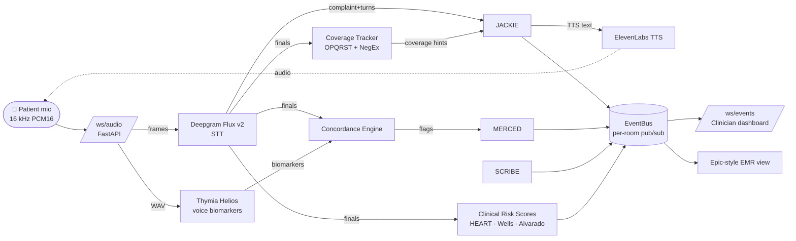
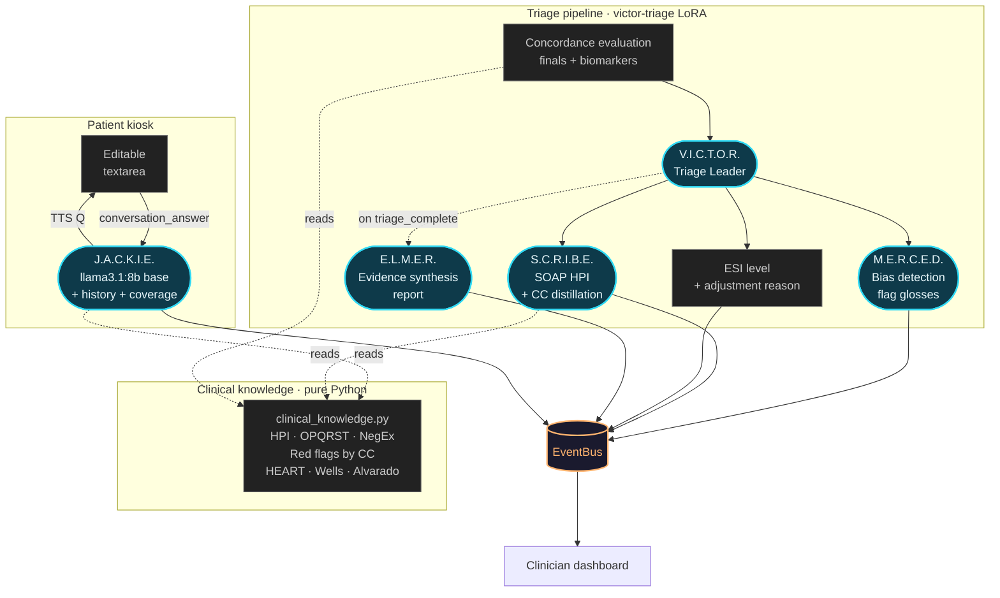

# V.I.C.T.O.R.

**Voice-first AI triage agent that catches cardiovascular disease presentations standard triage misses.**

Built for the AMD Developer Hackathon (May 4–10, 2026).

---

## Architecture

Three parallel signals from one voice input:

1. **What the patient says** → Deepgram Flux Multilingual (transcript)
2. **How they say it** → Thymia Helios + Apollo (voice biomarkers)
3. **What doesn't add up** → Concordance Engine + 5-Agent Swarm (bias-aware triage)

5-agent swarm on Llama 3 8B / vLLM / AMD MI300X:

- **V.I.C.T.O.R.** — Triage Leader (orchestrator)
- **J.A.C.K.I.E.** — Patient Voice (conversational interviewer)
- **M.E.R.C.E.D.** — Concordance Analyst (silent bias detection)
- **S.C.R.I.B.E.** — Clinical Note Writer (real-time SOAP)
- **E.L.M.E.R.** — Evidence Synthesiser (end-of-triage report)

See `VICTOR_PRD.md` for full spec.

### Signal pipeline

Audio is captured in the browser (16 kHz PCM16, 40 ms frames), streamed
to FastAPI over WebSockets, fanned to Deepgram Flux v2 (STT) and Thymia
Helios (voice biomarkers) in parallel, joined by the concordance engine,
and published onto a per-room async event bus the clinician dashboard
subscribes to.



### 5-agent swarm orchestration

V.I.C.T.O.R. is event-driven: every Helios biomarker submission triggers a
concordance evaluation, and the orchestrator fans the result out to
M.E.R.C.E.D., S.C.R.I.B.E., and (at end-of-triage) E.L.M.E.R. J.A.C.K.I.E.
runs an independent loop driven by the patient's editable conversation
textarea, with `services/coverage_tracker.py` keeping her on-script for
OPQRST/SAMPLE coverage.



**Why this shape:**

- **J.A.C.K.I.E. uses base llama3.1:8b**, the other four use the `victor-triage` LoRA (MI300X-trained on 60k MIMIC-IV cases). The fine-tune leaks therapy-coded language at the bedside; the base model speaks the ED-triage register cleanly.
- **One source of truth for clinical knowledge.** `services/clinical_knowledge.py` owns the Bates' HPI dimensions, OPQRST/SAMPLE element regexes, NegEx pertinent-negative concepts (Chapman 2001), red-flag libraries per chief complaint, priority orderings, and validated risk scores (HEART / Wells / Alvarado). Citation-grounded against current US/UK guidelines (AHA/ACC 2021, NICE NG185, ESC 2023, ACEP, RCEM, ATLS, Surviving Sepsis 2021). Every agent imports from here.
- **The clinician sees agent activity but never reasoning.** Each agent emits `agent_activity` events for the swarm panel. The actual prompt-response round-trips stay backend-side; only the gloss/score/note lands in the dashboard.

---

## Repo layout

```
victor/
├── frontend/   React + Tailwind (Vite)
├── backend/    FastAPI + WebSocket
├── data/       .gitignored — MIMIC-IV / MUSIC (NEVER committed)
└── ...
```

---

## Local dev

### Backend

```bash
cd backend
python -m venv .venv && source .venv/bin/activate
pip install -r requirements.txt
cp ../.env.example ../.env       # fill in keys
uvicorn main:app --reload --port 8000
```

Health check: `curl http://localhost:8000/health` → `{"status":"ok"}`

WebSocket: `ws://localhost:8000/ws/audio?room=demo&voice=victor`

### Frontend

```bash
cd frontend
npm install
npm run dev
```

Three views are available:

- <http://localhost:5173/patient> — kiosk: 3-phase voice intake (name → DOB → reason for visit) with confirmation cards.
- <http://localhost:5173/clinician> — V.I.C.T.O.R. dashboard: live transcript, captured intake, biomarkers, SOAP draft, 5-agent swarm panel.
- <http://localhost:5173/clinician/epic> — Epic-style EMR view: patient banner, ESI acuity, concordance flag, SOAP, and clinician sign-off.

Captured fields propagate from the patient kiosk to the clinician dashboard and EMR view in the same browser tab; a hard refresh clears them.

The frontend expects the backend at `VITE_BACKEND_WS_URL` (defaults to `ws://localhost:8000`).

---

## Data compliance

- Raw MIMIC-IV CSVs are **never** committed.
- No individual patient data is exposed in the application.
- MIMIC-IV informs system prompts as aggregate clinical knowledge only.
- No audio persisted — ephemeral rooms only.

See `.gitignore`.

---

## License

MIT.
